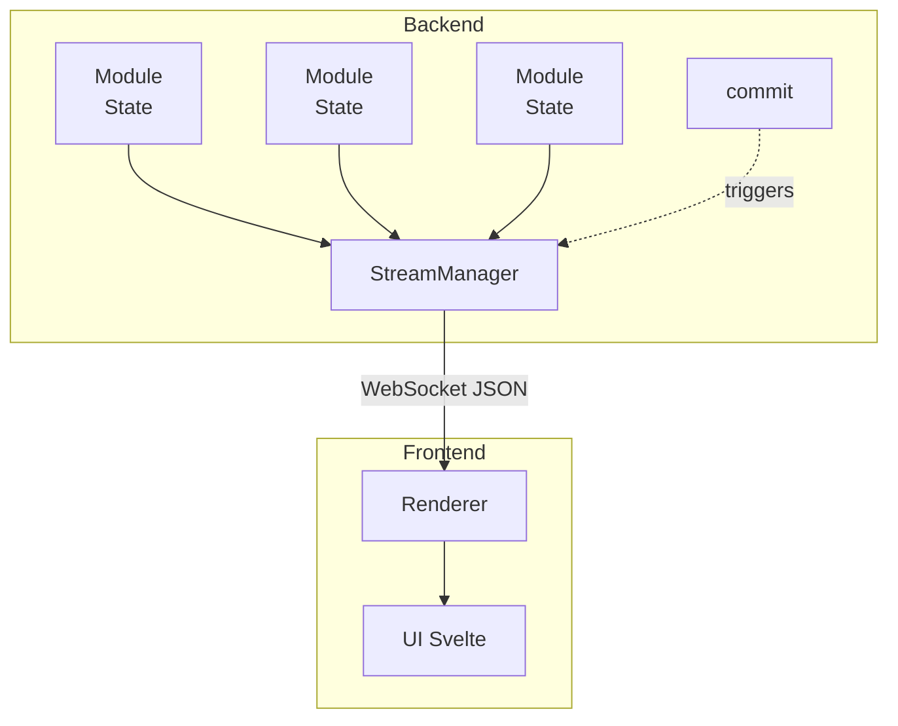

# Internals

Welcome to the internals documentation. These articles explain how ContaraNAS works under the hood: the design decisions, the architecture, and the "why" behind the implementation.

**You don't need to read these to build modules.** The [Module Development](../modules/index.md) docs cover everything a module author needs. This section is for the curious, those who want to understand the architecture or contribute to the core.

## Articles

| Article | Description |
|---------|-------------|
| [The Render Pipeline](render-pipeline.md) | How your Python code becomes pixels on screen |
| [Server-Driven UI](server-driven-ui.md) | Why we chose this architecture and how it works |
| [Type Generation](type-generation.md) | How Python types become TypeScript |

## The Big Picture

ContaraNAS follows a **server-driven UI** pattern. The backend is the source of truth for everything: state, UI definitions, business logic. The frontend is a thin rendering layer that displays what the server tells it to.

This architecture means:

- **Modules are Python-only** — No JavaScript knowledge required
- **UI is always in sync** — State changes automatically push to frontend
- **Type safety end-to-end** — Pydantic models generate TypeScript types
- **Centralized control** — The backend decides what the user sees

## Design Philosophy

**1. Simplicity over flexibility**

Module authors write Python. They don't touch HTML, CSS, or JavaScript. The tradeoff is that modules can't do arbitrary UI things — they work within the component system. For 95% of use cases, this is the right tradeoff.

**2. Convention over configuration**

Modules follow a predictable structure. State is a nested class. Actions are decorated methods. The framework handles the wiring.

**3. Explicit over implicit**

`commit()` is explicit. You decide when state changes push to the frontend. Auto-commit in actions is a convenience, not magic — it happens at a well-defined point (after the action completes).

**4. Real-time by default**

WebSocket is the primary communication channel. REST exists for one-off operations, but the app lives on the WebSocket connection.

## Other Documentation

For the other details (WebSocket message formats, REST endpoints, auth flow), the code itself is the documentation:

| Topic | Location |
|-------|----------|
| WebSocket Protocol | `backend/ContaraNAS/api/stream.py` |
| REST API Routes | `backend/ContaraNAS/api/routes/` |
| Authentication | `backend/ContaraNAS/core/auth/` |
| Action Dispatch | `backend/ContaraNAS/core/action/dispatcher.py` |
