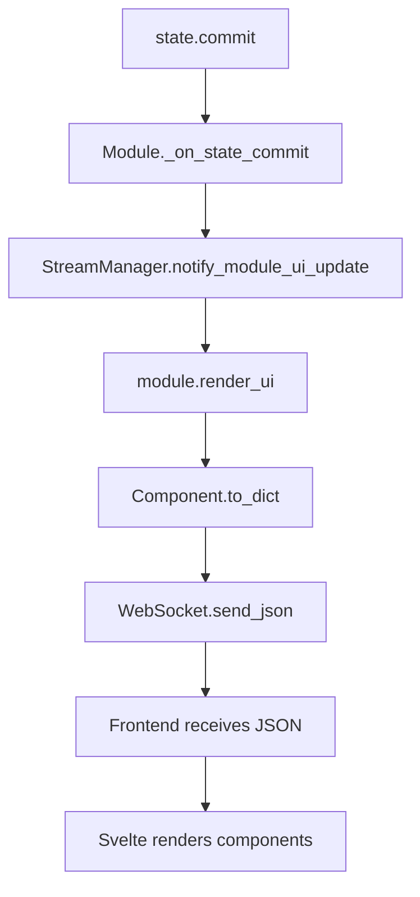
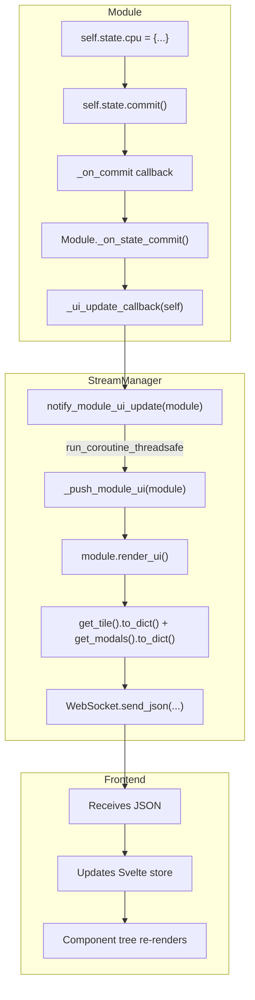

# The Render Pipeline

How does a Python object become pixels on screen? This article traces the journey from `state.commit()` to a rendered UI.

## The Journey

When you call `commit()` on your module's state, a chain reaction begins:



Let's trace each step.

## Step 1: The Commit

Every `ModuleState` has a commit callback that gets wired up when the module loads:

```python
# core/module/state.py
class ModuleState(BaseModel):
    _on_commit: Callable[[], Any] | None = PrivateAttr(default=None)

    def commit(self) -> None:
        """Signal that current state should be pushed to frontend"""
        if self._on_commit is not None:
            self._on_commit()
        self._last_committed = self._serialize()
        self._dirty = False
```

The callback is set by the module base class:

```python
# core/module/base.py
def _on_state_commit(self) -> None:
    """Called when state commits — trigger UI update"""
    if self._ui_update_callback is not None:
        self._ui_update_callback(self)
```

This indirection exists because state doesn't know about modules, and modules don't know about the streaming layer. Each layer only knows about its immediate neighbor.

## Step 2: The Stream Manager

The `StreamManager` is the bridge between modules and the WebSocket connection:

```python
# api/stream.py
class StreamManager:
    def notify_module_ui_update(self, module: Module) -> None:
        """Push a module's UI to connected clients"""
        if not self._client or not self._loop:
            return
        asyncio.run_coroutine_threadsafe(
            self._push_module_ui(module),
            self._loop,
        )
```

Why `run_coroutine_threadsafe`? Module background tasks might run on different threads. The WebSocket lives on the main asyncio event loop. This bridges that gap safely.

## Step 3: Rendering the UI

The module renders its current UI state:

```python
# api/stream.py
async def _push_module_ui(self, module: Module) -> None:
    ui = module.render_ui() if module.enable_flag else None
    await self._send({
        "type": "module_ui",
        "module": module.name,
        "display_name": module.display_name,
        "enabled": module.enable_flag,
        "initialized": module.init_flag,
        "ui": ui,
    })
```

And `render_ui()` builds the component tree:

```python
# core/module/base.py
def render_ui(self) -> dict[str, Any]:
    """Render the full UI for this module"""
    return {
        "tile": self.get_tile().to_dict(),
        "modals": [m.to_dict() for m in self.get_modals()],
    }
```

## Step 4: Component Serialization

Here's where Python objects become JSON. Every component has a `to_dict()` method:

```python
# core/ui/base.py
class Component(BaseModel):
    _type: ClassVar[str] = "component"

    def to_dict(self) -> dict[str, Any]:
        data: dict[str, Any] = {"type": self._type}
        for name, value in self:
            if value is None:
                continue
            data[name] = self._serialize_value(value)
        return data
```

The `_type` class variable is key — it tells the frontend which component to render:

```python
class Button(Component):
    _type: ClassVar[str] = "button"

class Stack(Component):
    _type: ClassVar[str] = "stack"
```

### Nested Components

Components can contain other components. The serialization handles this recursively:

```python
def _serialize_value(self, value: Any) -> Any:
    if isinstance(value, Component):
        return value.to_dict()
    if isinstance(value, list):
        return [self._serialize_value(v) for v in value]
    # ... handle other types
    return value
```

So this Python:

```python
Stack(
    direction="vertical",
    children=[
        Text(content="Hello"),
        Button(label="Click me"),
    ]
)
```

Becomes this JSON:

```json
{
    "type": "stack",
    "direction": "vertical",
    "children": [
        {"type": "text", "content": "Hello"},
        {"type": "button", "label": "Click me"}
    ]
}
```

### Action Serialization

Callable actions get special treatment:

```python
def _serialize_action(self, func: Callable) -> dict[str, Any]:
    action_name = getattr(func, "__action_name__", None)
    action_params = getattr(func, "__action_params__", None)
    if action_name:
        result: dict[str, Any] = {"__action__": action_name}
        if action_params:
            result["__params__"] = action_params
        return result
```

So `Button(label="Save", on_click=self.save_data)` becomes:

```json
{
    "type": "button",
    "label": "Save",
    "on_click": {"__action__": "save_data"}
}
```

The frontend knows that `__action__` means "call this endpoint when clicked."

## Step 5: WebSocket Transmission

The final JSON is sent over WebSocket:

```python
async def _send(self, data: dict) -> None:
    if self._client:
        data["timestamp"] = datetime.now().isoformat()
        await self._client.send_json(data)
```

Every message gets a timestamp for debugging and potential ordering.

## Step 6: Frontend Rendering

The frontend receives the JSON and renders it with Svelte components. Each `type` maps to a component:

```typescript
// Simplified - actual implementation uses a component registry
function renderComponent(schema: ComponentSchema) {
    switch (schema.type) {
        case "button": return <Button {...schema} />;
        case "stack": return <Stack {...schema} />;
        case "text": return <Text {...schema} />;
        // ...
    }
}
```

When an action is triggered (button click), the frontend sends a POST to `/api/modules/{name}/action/{action}` with any parameters.

## Dirty Tracking

Not every field change needs to push to the frontend. The state tracks what's "dirty":

```python
class ModuleState(BaseModel):
    _dirty: bool = PrivateAttr(default=False)
    _last_committed: dict[str, Any] | None = PrivateAttr(default=None)

    def __setattr__(self, name: str, value: Any) -> None:
        if not name.startswith("_"):
            self._dirty = True
        super().__setattr__(name, value)

    def get_changes(self) -> dict[str, Any] | None:
        """Get only the fields that changed"""
        if not self._dirty or self._last_committed is None:
            return None
        current = self._serialize()
        return {k: v for k, v in current.items()
                if k not in self._last_committed
                or self._last_committed[k] != v}
```

This lets you batch changes and commit once:

```python
self.state.cpu = new_cpu_data
self.state.memory = new_memory_data
self.state.disk = new_disk_data
self.state.commit()  # One push, not three
```

## Auto-Commit in Actions

The `@action` decorator auto-commits after the action completes:

```python
def action(func):
    async def wrapper(*args, **kwargs):
        result = await func(*args, **kwargs)

        # Auto-commit if state is dirty
        if args and hasattr(args[0], "_typed_state"):
            state = args[0]._typed_state
            if state is not None and state.is_dirty:
                state.commit()

        return result
    return wrapper
```

This is a convenience — most actions modify state and want it pushed. But you can still call `commit()` manually for progress updates during long operations.

## Performance Considerations

**Full UI on every commit**: Currently, `render_ui()` rebuilds the entire component tree. For most modules this is fine — the tree is small. Future optimization could diff and send patches.

**Thread safety**: `run_coroutine_threadsafe` ensures WebSocket operations happen on the main loop, even if the commit originated from a background thread.

**Batching**: There's no automatic batching. If you commit 10 times in rapid succession, that's 10 WebSocket messages. Batch your changes and commit once when possible.

## The Complete Flow



## See Also

- [Server-Driven UI](server-driven-ui.md) — Why this architecture
- [Type Generation](type-generation.md) — How Python types become TypeScript
