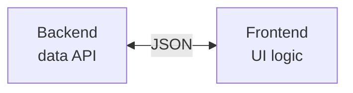
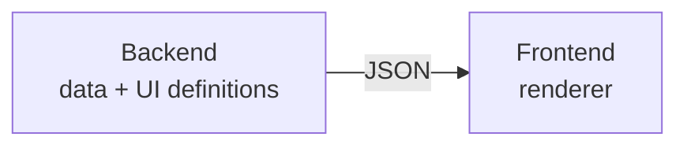

# Server-Driven UI

The frontend doesn't decide what to show. The server does. This is the core architectural decision that shapes everything else in ContaraNAS.

## The Problem with Traditional SPAs

In a typical single-page application, the frontend owns the UI:



The backend is a dumb data pipe. The frontend fetches data, decides how to display it, handles routing, manages local state. This works, but it has costs:

1. **Two codebases to maintain** — Backend (Python) + Frontend (TypeScript/React/Vue)
2. **Type drift** — Backend and frontend types can diverge
3. **Duplicated logic** — Validation, business rules, display logic split across both
4. **Module authors need frontend skills** — Want to add a module? Learn React.

For a NAS management app where we want community modules, that last point is a dealbreaker.

## The Server-Driven Alternative

ContaraNAS flips the model:



The backend sends complete UI descriptions. The frontend is a generic renderer that knows how to display a `Button`, `Table`, `Chart` — but doesn't know anything about modules or business logic.

## What Gets Sent

When a module's state changes, the backend sends its full UI tree:

```json
{
    "type": "module_ui",
    "module": "sys_monitor",
    "ui": {
        "tile": {
            "type": "tile",
            "icon": "cpu",
            "title": "System Monitor",
            "stats": [
                {"type": "stat", "label": "CPU", "value": "45%"},
                {"type": "stat", "label": "Memory", "value": "8.2 GB"}
            ],
            "content": [
                {
                    "type": "line_chart",
                    "data": [10, 25, 45, 30, 55],
                    "label": "CPU History"
                }
            ],
            "actions": [
                {
                    "type": "button",
                    "label": "Refresh",
                    "on_click": {"__action__": "refresh"}
                }
            ]
        },
        "modals": []
    }
}
```

The frontend doesn't interpret this. It just renders it. A `tile` becomes a `<Tile>` component. A `button` becomes a `<Button>`. The nesting is preserved.

## The Component Contract

The backend and frontend agree on a component vocabulary:

| Type | Props | Frontend Renders |
|------|-------|------------------|
| `tile` | icon, title, stats, content, actions | Dashboard card |
| `button` | label, variant, on_click | Clickable button |
| `text` | content, variant, size | Styled text |
| `progress` | value, max, label, color | Progress bar |
| `table` | columns, data, sortable | Data table |
| ... | ... | ... |

This is the contract. The backend promises to send valid component trees. The frontend promises to render them correctly.

## Actions: The Callback Mechanism

UI without interactivity is just a dashboard. The server-driven model handles actions through a callback mechanism:

```python
# Backend
Button(label="Save", on_click=self.save_settings)
```

```json
// Serialized
{"type": "button", "label": "Save", "on_click": {"__action__": "save_settings"}}
```

When the user clicks, the frontend doesn't handle it — it calls back to the server:

```
POST /api/modules/my_module/action/save_settings
```

The server runs the action, updates state, and pushes the new UI. The frontend just renders whatever comes back.

## Why This Works for ContaraNAS

**Module authors write Python only.** They define state, write business logic, and build UI using Python component classes. No JavaScript, no frontend tooling, no build step.

```python
class MyModule(Module):
    class State(ModuleState):
        count: int = 0

    def get_tile(self) -> Tile:
        return Tile(
            icon="counter",
            title="Counter",
            stats=[Stat(label="Count", value=self.state.count)],
            actions=[Button(label="+1", on_click=self.increment)],
        )

    @action
    async def increment(self):
        self.state.count += 1
```

That's it. The framework handles serialization, WebSocket pushing, and frontend rendering.

**Consistency is automatic.** All modules use the same components. They all look like they belong together. There's no way to break out and do custom CSS that clashes with everything else.

**Type safety is preserved.** The Python components are Pydantic models. They validate at construction time. Invalid props are caught immediately, not when a user happens to trigger a certain code path.

## The Tradeoffs

Nothing is free. Server-driven UI has costs:

### Less Flexibility

You can't do arbitrary UI. Want a custom D3.js visualization? Can't do it (yet). You're limited to the component vocabulary.

For ContaraNAS, this is acceptable. We're building a NAS management app, not a design tool. The component set covers the use cases.

### Network Dependency

Every interaction round-trips to the server. Click a button → POST to server → server processes → WebSocket pushes new UI.

For a local network app, latency is sub-millisecond. For a remote connection, it's noticeable. We mitigate with optimistic UI updates where possible.

### Larger Payloads

We send the full UI tree, not just data. A table with 100 rows sends all 100 rows in the component structure, not a separate data fetch.

For our use case (dashboards, not spreadsheets), payload size is reasonable. Modules with large datasets should paginate.

## Alternatives Considered

### Micro-Frontends

Each module ships its own frontend bundle. The host app loads and renders them.

**Rejected because:** Module authors still need frontend skills. Bundle management is complex. Style isolation is hard.

### Template Rendering (Jinja/HTML)

Server renders HTML strings. Frontend injects them.

**Rejected because:** No reactivity. Security concerns (XSS). Poor mobile experience.

### GraphQL + Frontend Components

Backend exposes data via GraphQL. Frontend has smart components that query what they need.

**Rejected because:** Still requires frontend knowledge. Type generation is more complex. Module authors need to touch both sides.

## Implementation Details

### The Component Base Class

```python
class Component(BaseModel):
    _type: ClassVar[str] = "component"

    def to_dict(self) -> dict[str, Any]:
        data: dict[str, Any] = {"type": self._type}
        for name, value in self:
            if value is None:
                continue
            data[name] = self._serialize_value(value)
        return data
```

Pydantic gives us validation. The `_type` class variable provides the discriminator. `to_dict()` handles recursive serialization.

### Frontend Component Registry

The frontend maps types to Svelte components:

```typescript
const componentRegistry = {
    tile: TileComponent,
    button: ButtonComponent,
    text: TextComponent,
    // ...
};

function render(schema: ComponentSchema): SvelteComponent {
    const Component = componentRegistry[schema.type];
    return new Component({ props: schema });
}
```

Unknown types are handled gracefully (logged, rendered as placeholder).

### Real-Time Updates

State changes push immediately via WebSocket. The frontend maintains a reactive store:

```typescript
// Simplified
websocket.onmessage = (event) => {
    const msg = JSON.parse(event.data);
    if (msg.type === "module_ui") {
        modules.update(m => ({
            ...m,
            [msg.module]: msg.ui
        }));
    }
};
```

Svelte's reactivity takes care of the rest — changed data flows to components, components re-render.

## The Design Philosophy

Server-driven UI is opinionated. It says: "The server knows best."

For ContaraNAS, this opinion is correct. The server has the data. The server has the business logic. The server should have the UI logic too.

The frontend is a rendering engine. It's really good at one thing: taking a component tree and putting pixels on screen. Let it do that job, and let the server do everything else.

## See Also

- [The Render Pipeline](render-pipeline.md) — How commit() becomes pixels
- [Type Generation](type-generation.md) — Keeping Python and TypeScript in sync
