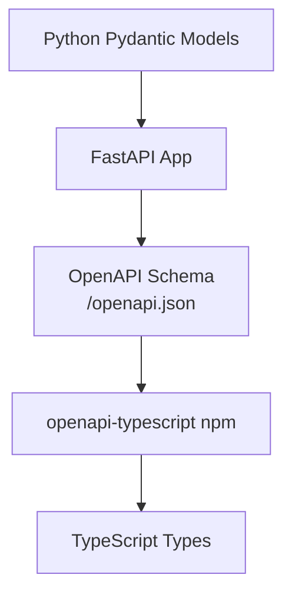
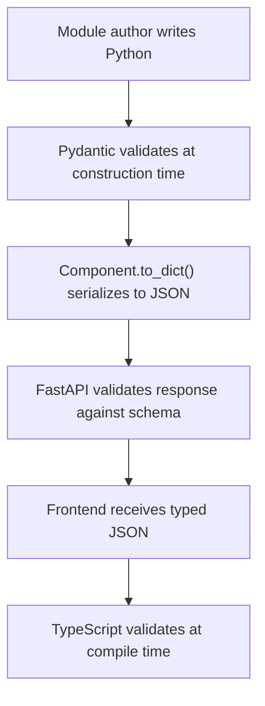

# Type Generation

Python is dynamically typed (sort of). TypeScript is statically typed. They need to talk to each other. This article explains how ContaraNAS bridges that gap.

## The Problem

The backend defines components in Python:

```python
class Button(Component):
    label: str
    variant: Literal["primary", "secondary", "ghost", "danger"] = "primary"
    on_click: Callable | None = None
    disabled: bool = False
```

The frontend needs TypeScript types:

```typescript
interface ButtonSchema {
    type: "button";
    label: string;
    variant: "primary" | "secondary" | "ghost" | "danger";
    on_click: ActionRef | null;
    disabled: boolean;
}
```

Keeping these in sync manually is a recipe for bugs. Change a Python field, forget to update TypeScript, and you get runtime errors that your type system should have caught.

## The Solution: OpenAPI

ContaraNAS uses FastAPI, which automatically generates OpenAPI schemas from Pydantic models. We leverage this for type generation:



The process is automated. Run `pnpm run generate` in the frontend, and TypeScript types regenerate from the current backend schema.

## The Schema Layer

Here's the key insight: we maintain two parallel hierarchies.

**Runtime components** (what modules use):

```python
# core/ui/interactive.py
class Button(Component):
    _type: ClassVar[str] = "button"
    label: str
    on_click: Callable | None = None
    # ...
```

**Schema components** (what the API exposes):

```python
# api/schemas/components.py
class ButtonSchema(BaseModel):
    type: Literal["button"] = "button"
    label: str
    on_click: ActionRef | None = None
    # ...
```

Why two? The runtime `Button` has a `Callable` for `on_click`. That can't be serialized to JSON or expressed in OpenAPI. The schema version has `ActionRef` — a serializable representation.

## The Component Union

The frontend needs to know all possible component types. We use a discriminated union:

```python
# api/schemas/ui.py
ComponentSchema = Annotated[
    StackSchema
    | GridSchema
    | CardSchema
    | TileSchema
    | StatSchema
    | ButtonSchema
    | TextSchema
    | ProgressSchema
    | BadgeSchema
    | TableSchema
    | TableColumnSchema
    | InputSchema
    | SelectSchema
    | SelectOptionSchema
    | ToggleSchema
    | CheckboxSchema
    | ModalSchema
    | AlertSchema
    | SpinnerSchema
    | StatCardSchema
    | StatSmallSchema
    | LineChartSchema
    | ImageSchema
    | TabsSchema
    | TabSchema
    | SegmentedProgressSchema
    | SegmentedProgressSegmentSchema,
    Field(discriminator="type"),
]
```

The `discriminator="type"` tells Pydantic (and OpenAPI) that `type` determines which variant it is. This becomes a TypeScript discriminated union:

```typescript
type ComponentSchema =
    | StackSchema
    | GridSchema
    | ButtonSchema
    // ...
```

TypeScript can then narrow types based on the `type` field:

```typescript
function render(component: ComponentSchema) {
    if (component.type === "button") {
        // TypeScript knows this is ButtonSchema
        console.log(component.label);
    }
}
```

## Action References

Actions are the trickiest part. In Python, they're methods:

```python
Button(label="Save", on_click=self.save_data)
```

But `self.save_data` isn't JSON-serializable. The serialization layer converts it:

```python
# core/ui/base.py
def _serialize_action(self, func: Callable) -> dict[str, Any]:
    action_name = getattr(func, "__action_name__", None)
    action_params = getattr(func, "__action_params__", None)
    if action_name:
        result: dict[str, Any] = {"__action__": action_name}
        if action_params:
            result["__params__"] = action_params
        return result
```

The schema layer models this:

```python
# api/schemas/ui.py
class ActionRef(BaseModel):
    __action__: str = Field(alias="__action__")
    __params__: dict[str, Any] | None = Field(default=None, alias="__params__")
```

Which generates:

```typescript
interface ActionRef {
    __action__: string;
    __params__?: Record<string, unknown> | null;
}
```

## The Generation Script

In the frontend, `package.json` has:

```json
{
    "scripts": {
        "generate": "openapi-typescript http://localhost:8000/openapi.json -o src/lib/api/types.generated.ts"
    }
}
```

Run `pnpm run generate` while the backend is running, and it:

1. Fetches `/openapi.json` from the backend
2. Generates TypeScript types
3. Writes to `src/lib/api/types.generated.ts`

This file is checked into git. CI can verify it's up-to-date by regenerating and checking for diffs.

## What Gets Generated

The generated file includes:

**Component schemas:**

```typescript
export interface ButtonSchema {
    type: "button";
    label: string;
    on_click?: ActionRef | null;
    variant?: "primary" | "secondary" | "ghost" | "danger";
    size?: "sm" | "md" | "lg";
    icon?: string | null;
    icon_only?: boolean;
    disabled?: boolean;
    loading?: boolean;
}
```

**API response types:**

```typescript
export interface ModuleUIResponse {
    name: string;
    display_name: string;
    enabled: boolean;
    initialized: boolean;
    tile: TileSchema | null;
    modals: ModalSchema[];
}
```

**Path operation types:**

```typescript
export interface operations {
    invoke_action_api_modules__module_name__action__action_name__post: {
        parameters: {
            path: { module_name: string; action_name: string };
        };
        requestBody?: { content: { "application/json": Record<string, unknown> } };
        responses: { 200: { content: { "application/json": ActionResponse } } };
    };
}
```

## Custom Type Transformations

Some Python types don't map cleanly to TypeScript. We handle these with Pydantic's serialization:

**Datetime:**

```python
class State(ModuleState):
    last_update: datetime | None = None

    @field_serializer('last_update')
    def serialize_datetime(self, dt: datetime | None) -> str | None:
        return dt.isoformat() if dt else None
```

In TypeScript, this becomes `string | null`.

**Enums:**

```python
class Button(Component):
    variant: Literal["primary", "secondary", "ghost", "danger"] = "primary"
```

Literal types map directly to TypeScript union types:

```typescript
variant: "primary" | "secondary" | "ghost" | "danger";
```

## Keeping Things in Sync

The schema layer is the source of truth for the API contract. When you add a new component:

1. Create the runtime component in `core/ui/`
2. Create the schema in `api/schemas/components.py`
3. Add to the `ComponentSchema` union
4. Run `pnpm run generate` in frontend
5. Implement the frontend component

Steps 2-4 ensure type safety. If you forget step 2, the component won't appear in the generated types, and the frontend TypeScript will error when it encounters an unknown type.

## The Tradeoff: Duplication

Yes, we define components twice — once for runtime, once for schema. This feels redundant.

We considered alternatives:

**Generate schemas from runtime classes:** Possible, but `Callable` fields are problematic. We'd need custom type transformers, and the mapping gets complex.

**Use schemas at runtime:** Would work, but schemas have `ActionRef` where runtime needs `Callable`. We'd need to transform on every render.

**Single source with annotations:** Mark which fields are schema-only vs runtime-only. Gets messy with inheritance.

The explicit duplication is more code, but it's simple code. Each layer does one thing. The schemas are a clear API contract that doesn't leak implementation details.

## Validation Flow

With types generated, the full validation flow is:



Bugs are caught early. If a module author passes an invalid prop, Pydantic errors immediately. If the schema doesn't match the runtime, the tests fail. If the frontend uses a field that doesn't exist, TypeScript errors at build time.

## See Also

- [Server-Driven UI](server-driven-ui.md) — The architecture that needs these types
- [The Render Pipeline](render-pipeline.md) — How components get serialized
