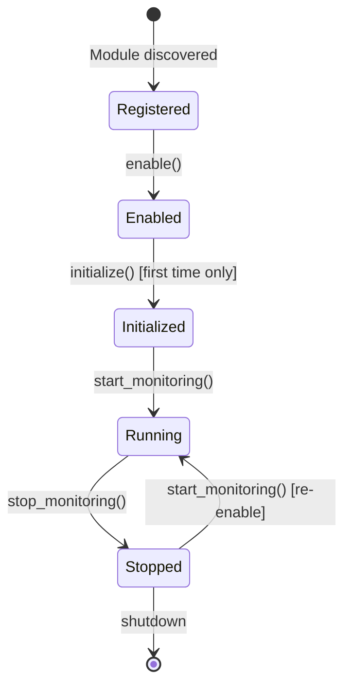

# Module Lifecycle

Every module goes through a predictable sequence of states:



## Lifecycle Methods

Your module must implement three abstract methods that control its lifecycle:

### `initialize()`

```python
async def initialize(self) -> None:
    """One-time setup when module is first enabled"""
```

**When called:** Once, the first time your module is enabled.

**What to do here:**

- Load configuration from disk
- Initialize services and connections
- Perform one-time setup that should persist across enable/disable cycles
- Set initial state values

**Example:**

```python
async def initialize(self) -> None:
    self.config = await self._load_config()
    self.api_client = ApiClient(self.config.api_key)

    if self._typed_state:
        self._typed_state.initialized_at = datetime.now().isoformat()
        self._typed_state.commit()
```

!!! note "Called Only Once"
    `initialize()` is only called the **first time** a module is enabled. Subsequent enable/disable cycles skip initialization. Use `start_monitoring()` for setup that needs to run on every enable.

---

### `start_monitoring()`

```python
async def start_monitoring(self) -> None:
    """Start event handlers, watchers, and background tasks"""
```

**When called:** Every time the module is enabled (after `initialize()` on first enable).

**What to do here:**

- Start background tasks (asyncio tasks, timers)
- Begin file system watchers
- Open WebSocket connections
- Start periodic data collection

**Example:**

```python
async def start_monitoring(self) -> None:
    # Start a periodic collection task
    self._collection_task = asyncio.create_task(self._collect_loop())

    # Start file watcher
    self._watcher = FileWatcher(self.watch_path)
    self._watcher.start()

async def _collect_loop(self) -> None:
    while True:
        await self._collect_data()
        await asyncio.sleep(5)  # Collect every 5 seconds
```

---

### `stop_monitoring()`

```python
async def stop_monitoring(self) -> None:
    """Stop all event handlers, watchers, and background tasks"""
```

**When called:** Every time the module is disabled.

**What to do here:**

- Cancel all background tasks
- Stop file watchers
- Close connections
- Clean up temporary resources

**Example:**

```python
async def stop_monitoring(self) -> None:
    # Cancel background task
    if self._collection_task:
        self._collection_task.cancel()
        try:
            await self._collection_task
        except asyncio.CancelledError:
            pass

    # Stop file watcher
    if self._watcher:
        self._watcher.stop()
```

!!! warning "Always Clean Up"
    Failing to properly clean up in `stop_monitoring()` can cause resource leaks, especially with file watchers and asyncio tasks.

---

## Lifecycle Flags

The framework tracks your module's state using two flags:

| Flag | Type | Description |
|------|------|-------------|
| `init_flag` | `bool` | `True` after `initialize()` has been called successfully |
| `enable_flag` | `bool` | `True` when the module is currently enabled and running |

You generally don't need to modify these flags directly—the framework manages them.

**Reading the flags:**

```python
def get_tile(self) -> Tile:
    if not self.init_flag:
        return Tile(title="Not Initialized", ...)

    if not self.enable_flag:
        return Tile(title="Disabled", ...)

    # Normal tile rendering
    return Tile(...)
```

---

## Complete Lifecycle Flow

Here's exactly what happens when a user enables and disables your module:

### First Enable

1. User clicks "Enable" in the UI
2. Framework calls `module.enable()`
3. Since `init_flag` is `False`:
   - Framework calls `await module.initialize()`
   - Sets `init_flag = True`
4. Framework calls `await module.start_monitoring()`
5. Sets `enable_flag = True`
6. UI is updated via state commit

### Subsequent Disable

1. User clicks "Disable" in the UI
2. Framework calls `module.disable()`
3. Framework calls `await module.stop_monitoring()`
4. Sets `enable_flag = False`
5. UI is updated

### Re-Enable (After Disable)

1. User clicks "Enable" again
2. Framework calls `module.enable()`
3. Since `init_flag` is already `True`:
   - `initialize()` is **not** called
4. Framework calls `await module.start_monitoring()`
5. Sets `enable_flag = True`

---

## Best Practices

### Separate Concerns

Keep initialization logic (one-time) separate from monitoring logic (repeatable):

```python
async def initialize(self) -> None:
    # One-time: discover Steam installation path
    self.steam_path = await self._find_steam()
    self.cache_service = CacheService(self.steam_path)

async def start_monitoring(self) -> None:
    # Repeatable: start watching for changes
    self.watcher = LibraryWatcher(self.steam_path)
    self.watcher.start()
```

### Handle Errors Gracefully

Set error state rather than crashing:

```python
async def initialize(self) -> None:
    try:
        self.service = await ExternalService.connect()
    except ConnectionError as e:
        if self._typed_state:
            self._typed_state.error = f"Failed to connect: {e}"
            self._typed_state.commit()
```

### Store Task References

Always store references to background tasks so you can cancel them:

```python
def __init__(self, ...):
    super().__init__(...)
    self._tasks: list[asyncio.Task] = []

async def start_monitoring(self) -> None:
    task = asyncio.create_task(self._background_work())
    self._tasks.append(task)

async def stop_monitoring(self) -> None:
    for task in self._tasks:
        task.cancel()
    await asyncio.gather(*self._tasks, return_exceptions=True)
    self._tasks.clear()
```

### Use the State Property Pattern

For cleaner code, define a property to access typed state:

```python
class MyModule(Module):
    class State(ModuleState):
        counter: int = 0

    @property
    def state(self) -> "MyModule.State":
        """Type-safe state access"""
        assert self._typed_state is not None
        return self._typed_state

    @action
    async def increment(self) -> None:
        self.state.counter += 1  # Clean, no None checks needed
        self.state.commit()
```

---

## See Also

- [State Management](state.md) — How state changes trigger UI updates
- [Actions](actions.md) — Handling user interactions
- [module.json Reference](module-json.md) — Module metadata and dependencies
